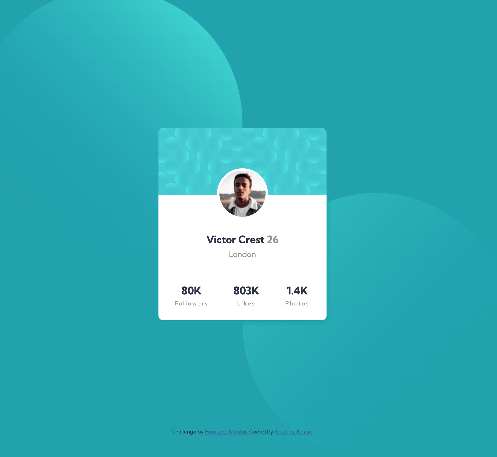
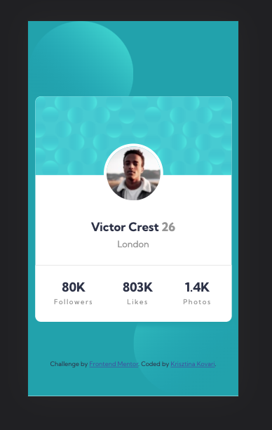

# Frontend Mentor - Profile card component solution

This is a solution to the [Profile card component challenge on Frontend Mentor](https://www.frontendmentor.io/challenges/profile-card-component-cfArpWshJ). Frontend Mentor challenges help you improve your coding skills by building realistic projects.

## Table of contents

- [Overview](#overview)
  - [The challenge](#the-challenge)
  - [Screenshot](#screenshot)
  - [Links](#links)
- [My process](#my-process)
  - [Built with](#built-with)
  - [What I learned](#what-i-learned)
  - [Useful resources](#useful-resources)
- [Author](#author)
- [Acknowledgments](#acknowledgments)

## Overview

### The challenge

- Build out the project to the designs provided

### Screenshot




### Links

- View site: [GithubPages](https://krystonen.github.io/profile-card-component-main/)
- See the source code: [Respository](https://github.com/krystonen/profile-card-component-main)

## My process

### Built with

- Semantic HTML5 markup
- CSS custom properties
- Flexbox
- Desktop-first workflow

### What I learned

My very first frontend masters challenge! It took me three sittings after work to complete this challenge, especially because I tried to improve the **HTML markup** and add provide **consistent css classnames** and of course to get to the design as close as possible.

It was the first time I used _description list_ and to trick the dt and dd into rows underneath each other (without adding more divs) was a challenge to figure out.

I tried to achieve the same look on all devices without using media queries.

HTML:

```html
<dl>
  <dt>80K</dt>
  <dd>Followers</dd>
  <dt>803K</dt>
  <dd>Likes</dd>
  <dt>1.4K</dt>
  <dd>Photos</dd>
</dl>
```

CSS:

```css
.card__footer dl {
  width: calc(100% - 20px);
  padding: 10px;
  display: flex;
  flex-flow: column wrap;
  align-items: center;
  max-height: 5em;
}

.card__footer dt {
  padding: 5px;
  text-align: center;
  font-weight: bold;
  font-size: 22px;
  color: var(--primary-text-color);
}

.card__footer dd {
  margin: 0;
  text-align: center;
  min-height: 2em;
  font-weight: normal;
  font-size: 12px;
  letter-spacing: 2px;
  color: var(--secondary-text-color);
}
```

```js
const proudOfThisFunc = () => {
  console.log("🎉");
};
```

### Useful resources

- [How to build card component](https://www.mediacurrent.com/blog/how-build-card-component) - This helped me with the semantic html markup.
- [CSS: Formatting a Definition List](https://www.the-art-of-web.com/css/format-dl/) - This is the source I used to align the elements in the footer.

## Author

- Website - [Krisztina Kovari](https://www.krisztinakovari.com)
- Frontend Mentor - [@krystonen](https://www.frontendmentor.io/profile/krystonen)
- codepen - [krystonen](https://codepen.io/krystonen/)
- Twitter - [@krystonen](https://www.twitter.com/krystonen)

## Acknowledgments

Thanks frontendmentors for this challenge and motivating me to share something on github!
